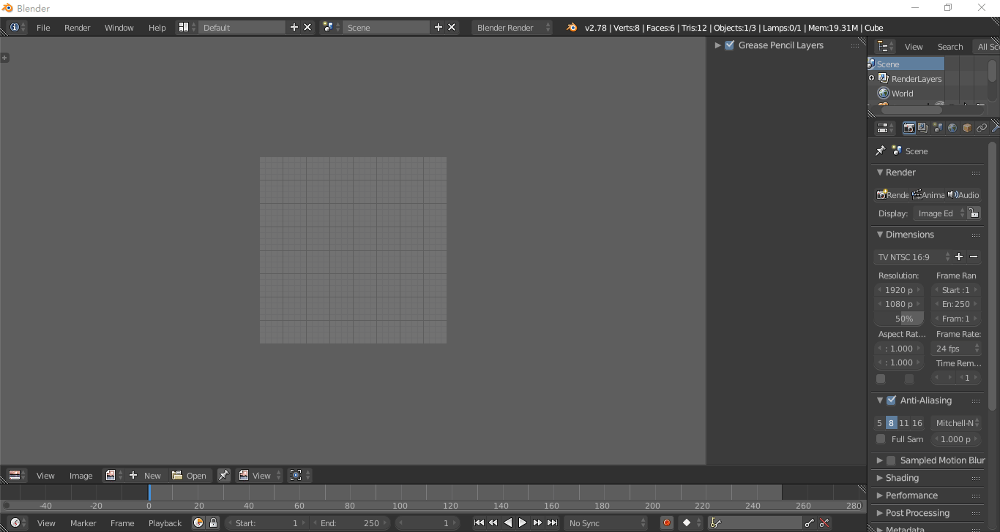

blender layers image

## 简介
blender 图片支持图层.  
项目基于MIT开源协议.

### 基于项目
- psd_tools
- packbit

### 使用
- 图层文件导入
- 图层visiable控制

### 图片格式
文件：8位RGBA格式 .psd
图层样式：正常模式

## FQA
### 速度慢
使用小尺寸的图片

## roadmap
- 使用视频介绍
- 支持更多的文件格式（16bit cmky等）
- 支持gimp和krita
- 支持图层样式
- 支持更多的操作：放大缩小，裁剪等

## 参考
